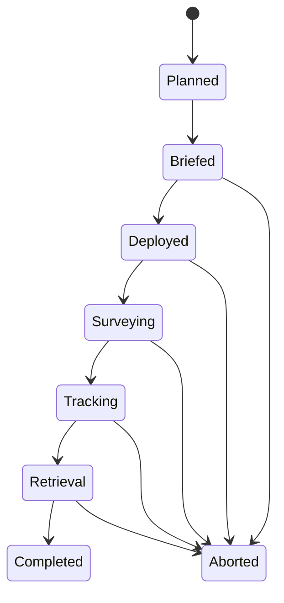

# Domain Reference: Project "Abyssal Watch"
## Case Study for Architectural & Design Patterns

This document is the canonical baseline for the Deep Sea Kaiju Exploration case study. It is intentionally minimal: enough to keep examples consistent across the book, while leaving room to extend details later when a chapter needs additional depth.

---

## 1. Domain Overview
In a near-future scenario, Earth's oceans contain "Breaches," which are extra-dimensional rifts on the seafloor. Massive biological entities known as "Kaiju" can emerge from these rifts. The "Abyssal Watch" project is a global initiative to monitor Breaches and track Kaiju activity using a fleet of Command Carriers and specialized Scout Vessels.

---

## 2. Ubiquitous Language & Glossary Rules

### 2.1 Canonical Terms and Aliases
Use the following terms as the single source of naming truth for examples, diagrams, and code snippets:

| Canonical Term | Allowed Alias | Notes |
| :--- | :--- | :--- |
| **Command Carrier** | Mother Ship (legacy) | Use "Command Carrier" by default. |
| **Scout Vessel** | Scout (short form) | Use "Scout" only after first canonical mention. |
| **Detection Buoy** | Buoy | Prefer full name in definitions. |
| **Breach** | None | Core domain concept; do not replace with "portal" or "rift" in models. |
| **Kaiju** | None | Use as domain entity name, singular/plural by context. |
| **Mission** | None | Represents the operational lifecycle from planning to closure. |
| **Observation** | Telemetry Record | Observation is the preferred term for recorded signals. |

### 2.2 Usage Rules
1. Use canonical terms in all headings, class names, sequence diagrams, and schema examples.
2. Introduce aliases only once, then prefer canonical terms.
3. Do not introduce new synonyms unless they are explicitly mapped in this glossary.
4. If a chapter adds more detail, it must extend this vocabulary rather than replacing it.

### 2.3 Naming Intent
This glossary is a baseline vocabulary for consistency, not a complete ontology of the domain.

---

## 3. Entity Catalog (Baseline Data Schema)

### 3.1 Command Carrier
Primary mobile operations base.
* **Attributes:**
    * `CarrierID`: Unique Identifier (e.g., CVN-81)
    * `Name`: Designation (e.g., "The Aegis")
    * `Position`: GPS Coordinates (Lat, Long)
    * `Status`: Enum {Stationary, InTransit, CombatReady, Maintenance}
    * `DeploymentCapacity`: Integer (max number of Scout Vessels it can hold)
    * `CommunicationRange`: Float (kilometers)

### 3.2 Scout Vessel
Submersible platform deployed from a Command Carrier.
* **Attributes:**
    * `VesselID`: Unique Identifier
    * `Type`: Enum {Manned, Unmanned}
    * `Model`: String (e.g., "Ghost-Ray v2")
    * `CurrentDepth`: Float (meters)
    * `BatteryLevel`: Percentage (0-100)
    * `OxygenLevel`: Percentage (required only for manned vessels)
    * `MaxDepthRating`: Float
    * `HealthStatus`: Percentage (hull integrity)
    * `Sensors`: List of Enums {Seismic, Acoustic, Radiation, Thermal, Visual}

### 3.3 Crew Member
Human personnel assigned to manned Scout Vessels.
* **Attributes:**
    * `PersonnelID`: Unique Identifier
    * `Name`: String
    * `Role`: Enum {Pilot, Scientist, Engineer, TacticalOfficer, Diver}
    * `YearsOfService`: Integer
    * `MedicalFitness`: Boolean

### 3.4 Breach
Fixed rift on the ocean floor.
* **Attributes:**
    * `BreachID`: Unique Identifier
    * `Codename`: String (e.g., "The Marianas Maw")
    * `Location`: GPS (Lat, Long, Depth)
    * `StabilityIndex`: Float
    * `RadiationLevel`: Float (uSv/h)
    * `LastActivityTimestamp`: DateTime

### 3.5 Kaiju
Biological anomaly tracked by the system.
* **Attributes:**
    * `KaijuID`: Unique Identifier (e.g., K-09)
    * `Codename`: String (e.g., "Leatherback")
    * `Classification`: Enum {Category-I through Category-V}
    * `Mass`: Float (tons)
    * `Height`: Float (meters)
    * `BioSignature`: String (acoustic/radiation pattern)
    * `LastKnownVelocity`: Vector (speed and direction)

### 3.6 Detection Buoy
Stationary monitoring node.
* **Attributes:**
    * `BuoyID`: Unique Identifier
    * `Position`: GPS (Lat, Long, Depth)
    * `SensorArray`: List of Enums {Seismic, Acoustic, Radiation, Thermal, Visual}
    * `UplinkStatus`: Boolean

### 3.7 Extensibility Note
This entity catalog is deliberately incomplete. Later chapters may add bounded fields, derived values, or supporting entities as needed for a specific pattern or architecture discussion.

---

## 4. Relationships & Cardinality

| Subject | Relationship | Object | Cardinality | Notes |
| :--- | :--- | :--- | :--- | :--- |
| **Command Carrier** | Deploys | **Scout Vessel** | 1 : N | A Command Carrier can manage many Scout Vessels. |
| **Scout Vessel** | Is Docked In | **Command Carrier** | N : 1 | A Scout Vessel is assigned to one Command Carrier. |
| **Manned Scout Vessel** | Contains | **Crew Member** | 1 : N | Usually 2-5 crew members per vessel. |
| **Scout Vessel / Detection Buoy** | Detects | **Kaiju** | N : N | Multiple sensor sources can track one Kaiju. |
| **Breach** | Originates | **Kaiju** | 1 : N | A Kaiju is linked to one origin Breach at first classification. |
| **Command Carrier** | Monitors | **Breach** | N : N | Command Carriers patrol assigned sectors of Breaches. |

---

## 5. Business Invariants (Baseline Examples)
These invariants are baseline examples to anchor consistency. Chapters may add stricter rules when needed.

- **INV-01 (Docking Consistency):** A Scout Vessel in `Docked` state is docked in exactly one Command Carrier.
- **INV-02 (Manned Safety Minimum):** A manned Scout Vessel must include oxygen telemetry and at least one Crew Member with `MedicalFitness = true`.
- **INV-03 (Carrier Capacity):** A Command Carrier cannot have more deployed Scout Vessels than `DeploymentCapacity`.
- **INV-04 (Kaiju Origin Link):** A Kaiju must reference exactly one origin Breach at first classification.
- **INV-05 (Mission Completion Gate):** A Mission cannot transition to `Completed` unless all deployed Scout Vessels are recovered or declared lost.

---

## 6. Core Lifecycle State Machine

### 6.1 Mission Lifecycle

### 6.2 Transition Guards (Illustrative)
| Transition | Guard / Precondition | Related Invariant |
| :--- | :--- | :--- |
| `Briefed -> Deployed` | Planned deployments fit within selected Command Carrier capacity. | `INV-03` |
| `Deployed -> Surveying` | At least one Scout Vessel has active sensor readiness. | Baseline operational guard |
| `Tracking -> Retrieval` | Tracking objective met or mission command issues retrieval order. | Baseline operational guard |
| `Retrieval -> Completed` | All deployed Scout Vessels recovered or declared lost. | `INV-05` |

### 6.3 Scout Vessel Mini-Lifecycle (Optional Reference)
`Docked -> LaunchReady -> Deployed -> Tracking -> Returning -> Docked`

---

## 7. Typical Mission Workflow
1. **Mission Briefing:** Command Carrier selects a Breach to investigate.
2. **Deployment:** Command Carrier launches 1-3 Scout Vessels (manned and/or unmanned).
3. **Survey:** Scout Vessels travel to Breach coordinates and record Observations (radiation, seismic, acoustic).
4. **Discovery:** If a Kaiju is detected, Scout Vessels begin tracking velocity and biosignature.
5. **Triangulation:** Multiple Scout Vessels and Detection Buoys refine the Kaiju position.
6. **Retrieval:** Scout Vessels return to the Command Carrier for data upload and mission closure.

---

## 8. Canonical Scenario Pack
These scenarios are intentionally concise and reusable. They are anchors for examples, not full specifications.

### SCN-01 Routine Breach Survey
- **Context:** Stable Breach with no recent Kaiju signature.
- **Trigger:** Scheduled patrol window opens.
- **Expected Outcome:** Survey data captured and uploaded to Command Carrier.
- **Architectural Stressor:** High telemetry ingestion volume.

### SCN-02 First Kaiju Detection and Confirmation
- **Context:** Scout Vessel records anomalous radiation plus acoustic pattern.
- **Trigger:** Detection confidence passes confirmation threshold.
- **Expected Outcome:** Kaiju record created and linked to origin Breach.
- **Architectural Stressor:** Fast correlation across sensor streams.

### SCN-03 Multi-Scout Triangulation
- **Context:** Two Scout Vessels and one Detection Buoy track same biosignature.
- **Trigger:** Mission command requests precise Kaiju coordinate lock.
- **Expected Outcome:** Position uncertainty narrows to mission threshold.
- **Architectural Stressor:** Consistent multi-source fusion timing.

### SCN-04 Retrieval with Partial Telemetry
- **Context:** One Scout Vessel has intermittent uplink near mission end.
- **Trigger:** Retrieval order issued after tracking window closes.
- **Expected Outcome:** Vessel docks and remaining data syncs on return.
- **Architectural Stressor:** Sync reconciliation after delayed connectivity.

### SCN-05 New Breach Discovered During Mission
- **Context:** Survey path reveals previously unknown seafloor anomaly.
- **Trigger:** Observation pattern qualifies as candidate Breach.
- **Expected Outcome:** New Breach record registered and flagged for follow-up.
- **Architectural Stressor:** Incremental schema extension without model breakage.

### SCN-06 Manned Scout Mission with Crew Constraints
- **Context:** Manned Scout Vessel assigned to deep survey.
- **Trigger:** Launch checklist validates crew and oxygen telemetry requirements.
- **Expected Outcome:** Mission proceeds only if manned safety constraints hold.
- **Architectural Stressor:** Rule enforcement on command-side validation.

---

## 9. Sample Data Examples
* **Command Carrier:** `CVN-01 "Pacific Star"`, Location: (35.0, 140.0), Capacity: 12.
* **Breach:** `B-01 "Challenger Deep"`, Depth: 10,900m, Stability: 0.85.
* **Scout Vessel:** `S-402 "Mantis"`, Type: Unmanned, MaxDepth: 12,000m.
* **Kaiju:** `K-01 "Slattern"`, Class: Category-V, Origin: `B-01`.